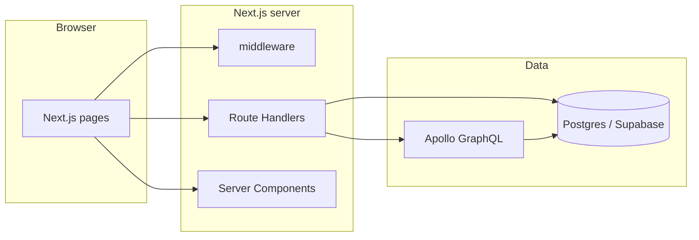

# Blueprint fullstack — Ecosystra (repo lokal)

Dokumen ini menjelaskan **arsitektur aplikasi saat ini**, **struktur repo** di `/Users/izzadev/.gemini/antigravity/scratch/Ecosystra`, serta **peran folder/berkas utama**. Lingkup produk: **Sign-in**, **Ecosystra** (board & view terembed), **Email**, **Chat**, **Calendar**.

---

## 1. Ringkasan produk

| Area | Peran |
|------|--------|
| **Auth** | NextAuth (JWT), Google OAuth opsional, kredensial via API `sign-in`. |
| **Ecosystra** | Workspace / board / task GraphQL (`/api/graphql`), UI besar di `components/ecosystra`. |
| **Email** | Inbox REST (`/api/email/*`) atau alur terkait GraphQL tergantung env; Prisma model `EcoEmail`. |
| **Chat** | Thread, pesan, lampiran, WebRTC; Supabase Realtime + REST `/api/chat/*`. |
| **Calendar** | FullCalendar + konteks React; seed konten dari `shadboard_page_content`. |

---

## 2. Stack teknologi

- **Framework:** Next.js 15 (App Router), React 19, TypeScript.
- **UI:** Tailwind CSS 4, Radix UI, shadcn-style `components/ui`.
- **Auth:** NextAuth.js + Prisma Adapter (`schema nextauth`).
- **ORM:** Prisma 5 → client di `src/generated/prisma` (multi-schema: `nextauth`, `shadboard_content`, `public`).
- **GraphQL:** Apollo Server route `app/api/graphql/route.ts` + Apollo Client di Ecosystra.
- **Realtime / file chat:** Supabase (`@supabase/ssr`, `@supabase/supabase-js`).
- **State:** React context + reducer (email/chat); TanStack Query provider global (siap dipakai).

---

## 3. Layout monorepo (akar repo)

| Path | Fungsi |
|------|--------|
| `package.json` | Workspace root: skrip `dev`, `dev:3002`, `build`, `db:*`, `migrate`, `migrate:deploy` mem-filter paket `shadboard-nextjs-full-kit`. |
| `pnpm-workspace.yaml` | Mendeklarasikan satu paket aplikasi: `shadboard/full-kit`. |
| `pnpm-lock.yaml` | Lockfile dependensi pnpm. |
| `.npmrc` | Opsi pnpm (mis. hoist); npm CLI bisa memunculkan peringatan — disarankan `pnpm` untuk perintah. |
| `node_modules/` | Dependensi yang di-hoist ke root workspace (tracing Next). |
| `blueprint/` | Dokumentasi arsitektur (berkas ini). |
| `shadboard/` | Folder induk proyek asal template; berisi **hanya** app produk di `full-kit/` + `README.md`, `LICENSE`, `.gitignore`. |

**Catatan:** Aplikasi yang di-deploy dan di-dev **hanyalah** `shadboard/full-kit`. Tidak ada paket npm lain di workspace.

---

## 4. Frontend (Next.js App Router)

Root app: `shadboard/full-kit/src/app/`.

| Segmen | Path | Fungsi |
|--------|------|--------|
| **Layout bahasa** | `[lang]/layout.tsx` | Font, metadata, `Providers`, locale (`en` / `ar`). |
| **Layout dashboard** | `[lang]/(dashboard-layout)/layout.tsx` | Shell: sidebar/header, `Layout` + dictionary. |
| **Layout auth** | `[lang]/(plain-layout)/layout.tsx` | Halaman tanpa chrome dashboard (sign-in). |
| **Sign-in** | `[lang]/(plain-layout)/(auth)/sign-in/page.tsx` | Halaman login. |
| **Ecosystra** | `.../apps/ecosystra/page.tsx`, `[view]/page.tsx`, `layout.tsx` | Shell SPA-embed board + view. |
| **Email** | `.../apps/email/...` | Inbox, detail, compose. |
| **Chat** | `.../apps/chat/[[...id]]/page.tsx`, `layout.tsx` | Thread chat. |
| **Calendar** | `.../apps/calendar/page.tsx` | Kalender. |
| **404 catch-all** | `[lang]/[...not-found]/page.tsx` | Not found. |
| **Global error** | `global-error.tsx`, `[lang]/global-error.tsx` | Error boundary. |
| **Themes** | `app/themes.css` | Variabel tema. |

**Navigasi sidebar / command palette:** `src/data/navigations.ts` — hanya grup **Apps** (Ecosystra, Email, Chat, Calendar).

**i18n:** `src/lib/get-dictionary.ts` memuat `src/data/dictionaries/en.json` & `ar.json`.

**Komponen layout:** `src/components/layout/*` — sidebar, header vertikal/horizontal, command menu, user dropdown, notifikasi (placeholder data).

---

## 5. Backend — Route Handlers (`src/app/api/`)

| Rute | Fungsi |
|------|--------|
| `api/auth/[...nextauth]/route.ts` | NextAuth handler. |
| `api/auth/sign-in/route.ts` | Validasi kredensial untuk Credentials provider. |
| `api/graphql/route.ts` | **Apollo Server** — domain Ecosystra (board, task, workspace, dll.). |
| `api/session/supabase/route.ts` | Probe sesi Supabase (bukan pengganti NextAuth). |
| `api/debug/auth-check/route.ts` | Debug auth. |
| `api/error-logs/route.ts` | Menerima log error klien. |
| **Email** | `api/email/messages`, `[id]`, mutasi read/star/archive/spam/mute/label/unread; `counts`, `send`. |
| **Chat** | `api/chat`, `threads`, `[threadId]/messages`, attachments, preferences, read, blocked, `compose-options`, forward/delete message. |
| **Ecosystra** | `api/ecosystra/board-filter-ai/route.ts` — filter board via AI. |
| **Cron** | `api/cron/due-date-reminders/route.ts` | Pengingat due date (server). |

**Guard session API umum:** `src/lib/api/route-session.ts` (`requireApiSession`, `requireSessionWithEmail`).

**Respons JSON umum:** `src/lib/api/http.ts` (`jsonOk`, `jsonError`).

---

## 6. Lapisan data

### 6.1 Prisma (`prisma/schema.prisma`)

- **Schema `nextauth`:** `User`, `Account`, `Session`, `VerificationToken`, `UserPreference` — identitas & sesi NextAuth/adapter.
- **Schema `shadboard_content`:** `ShadboardPageContent` — JSON seed per modul (**email**, **chat**, **calendar**). Tabel CRM template **sudah dihapus** dari schema; migrasi / SQL Supabase men-drop `crm_*` jika pernah ada.
- **Schema `public`:** Model domain **Ecosystra** — `Workspace`, `Folder`, `Board`, `Group`, `Item`, `User`, `Member`, `Email`, `ChatThread`, `ChatMember`, `ChatMessage`, notifikasi, audit, undangan assignee, dll.

**Migrasi Prisma:** `prisma/migrations/` — termasuk `20260419180000_drop_crm_shadboard_content` (drop CRM). File historis `20241026151136_init` adalah jejak migrasi awal (SQLite-era); produksi Supabase biasanya memakai `db push` + migrasi baru.

### 6.2 Supabase

- **Klien browser/server:** `src/lib/supabase/*` (`server.ts`, `middleware.ts`, `browser-client.ts`, `ssr-browser-client.ts`, `env.ts`, `service-client.ts`).
- **Tipe:** `src/lib/supabase/database.types.ts` (boleh di-regenerate dengan `scripts/supabase-gen-types.sh`).
- **SQL versioned:** `supabase/migrations/*.sql` — RLS / utilitas; termasuk drop CRM.

### 6.3 GraphQL & Ecosystra

- Resolver & skema: di bawah `src/lib/ecosystra` / modul terkait yang diimpor oleh `api/graphql`.
- **URL klien:** default same-origin `/api/graphql` (lihat env di README full-kit).

### 6.4 Email (REST)

- Query & mutasi: `src/lib/email/*` — inbox, resolve user, mutasi HTTP.

---

## 7. Autentikasi & middleware

| Berkas | Fungsi |
|--------|--------|
| `src/configs/next-auth.ts` | `authOptions`: providers, JWT, session, callbacks. |
| `src/configs/auth-routes.ts` | Peta rute **guest** (`/sign-in`) vs **public** (`/`). |
| `src/middleware.ts` | Locale, cookie session NextAuth, redirect unauthenticated → sign-in; perbaikan path `favicon.ico/...`. |
| `src/lib/auth-routes.ts` | Helper `isGuestRoute` / `isPublicRoute`. |

**Redirect setelah login:** `HOME_PATHNAME` / `NEXT_PUBLIC_HOME_PATHNAME` (disarankan `/apps/ecosystra`); `next.config.mjs` redirect `/:lang` untuk sesi yang sudah login.

---

## 8. Direktori `shadboard/full-kit/src/` (per folder)

| Folder | Fungsi |
|--------|--------|
| `app/` | Routing Next.js + API routes (lihat §4–5). |
| `components/auth/` | Layout & form sign-in, OAuth. |
| `components/ecosystra/` | Seluruh UI bisnis board (file besar: `ecosystra-board-main-view.tsx`, provider, navigasi, filter, tabel, dll.). |
| `components/layout/` | Shell aplikasi (sidebar, header, command menu, customizer). |
| `components/pages/` | Hanya `not-found-404` untuk catch-all. |
| `components/ui/` | Primitif UI (button, dialog, table, sidebar shadcn, chart, editor, …) dipakai lintas app. |
| `configs/` | `i18n`, `themes`, `next-auth`, `auth-routes`. |
| `contexts/` | `settings-context` — tema, locale, layout persisten (cookie). |
| `data/` | `navigations.ts`, `dictionaries/`, `notifications.ts`, `oauth-links.ts`, `user.ts` (demo user sign-in). |
| `hooks/` | `use-settings`, `use-toast`, `use-mobile`, RTL, radius, dll. |
| `lib/` | Util umum (`utils.ts`, `i18n`, `prisma`, `metadata-base`), `lib/api`, `lib/email`, `lib/ecosystra`, `lib/supabase`, `lib/webrtc`, `lib/chat-attachments-upload.ts`, `get-shadboard-page-content.ts`, `shadboard-page-modules.ts`, dll. |
| `providers/` | NextAuth, React Query, direction, mode. |
| `schemas/` | Zod untuk sign-in (dan lain jika ada). |
| `generated/prisma/` | **Output generate Prisma** — jangan edit manual. |

---

## 9. Akar paket `full-kit` (selain `src/`)

| Path | Fungsi |
|------|--------|
| `next.config.mjs` | `outputFileTracingRoot`, redirects (home, email→inbox, `/board` legacy), image remote Supabase. |
| `middleware.ts` | Salin ke `src/middleware.ts` — sebenarnya file aktif di `src/`. |
| `package.json` | Skrip dev/build/db/migrate, dependensi. |
| `pnpm-workspace.yaml` | Hanya `onlyBuiltDependencies` untuk build native (Prisma, sharp). |
| `prisma/` | `schema.prisma`, `migrations/`, `sql/` (manual SQL / dokumentasi operasional). |
| `public/` | `images/` (branding, ilustrasi welcome, avatar demo), favicon, manifest. |
| `scripts/` | `seed/page-content.json` (modul email/chat/calendar), `seed-shadboard-page-content.ts`, `migrate-sqlite-auth.cjs`, `supabase-gen-types.sh`, `verify-ecosystra-contrast.mjs`. |
| `supabase/migrations/` | DDL/RLS untuk proyek Supabase. |
| `vercel.json` | Cron / konfigurasi deploy. |
| `.env.example` | Contoh variabel lingkungan. |
| `README.md` | Cara jalanin & DB. |
| `components.json` | Konfigurasi shadcn CLI. |
| `eslint.config.mjs`, `prettier.config.mjs`, `tsconfig.json` | Kualitas & build TS. |

---

## 10. Yang sudah tidak ada di repo (riwayat refactor)

Telah dihapus sebelumnya (tidak muncul lagi di tree): template **Shadboard** (dashboard, design system, pages marketing), **starter-kit**, **Bluprint**, **modal/**, **docs** in-app, **CRM** API & model Prisma, komponen auth register/forgot/verify, **`GRANDBOOK.md`**, dll.

---

## 11. Pembersihan saat penyusunan blueprint ini

| Tindakan | Alasan |
|----------|--------|
| Menghapus `src/components/pricing-plans.tsx` | Halaman pricing sudah tidak ada; tidak ada impor. |
| Menghapus `src/components/credit-card-brand-icon.tsx` | Sama — tidak terpakai. |
| Menghapus `getCreditCardBrandName` dari `src/lib/utils.ts` | Hanya dipakai alur pembayaran yang sudah dihilangkan. |
| Menghapus folder kosong `src/lib/data/` | Bekas CRM; tidak ada impor. |

**Aset publik** (`public/images/logos/*`, `icons/shadboard.svg`, ilustrasi tambahan): mungkin tidak direferensikan kode; aman dibiarkan atau dibersihkan bertahap setelah pencarian referensi — tidak dihapus otomatis di sesi ini agar tidak merusak URL ketik.

---

## 12. Alur request (ringkas)

---

## 13. Perintah yang sering dipakai

| Perintah | Lokasi | Arti |
|----------|--------|------|
| `pnpm dev:3002` | root atau `full-kit` | Dev server port 3002. |
| `pnpm build` | root | Build produksi. |
| `pnpm db:push` | root | Sinkronkan schema Prisma ke DB. |
| `pnpm migrate:deploy` | root | Terapkan migrasi Prisma. |
| `pnpm db:seed-page-content` | root | Isi/refresh `shadboard_page_content` dari JSON seed. |

---

*Blueprint ini menggambarkan state repo pada saat penulisan. Setelah perubahan besar, sebaiknya diperbarui bersama commit.*
